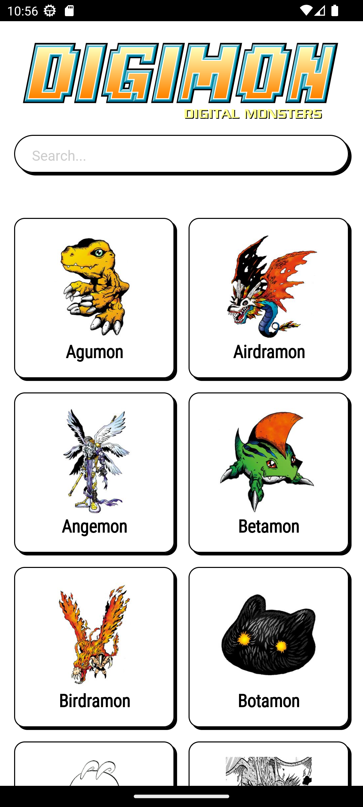
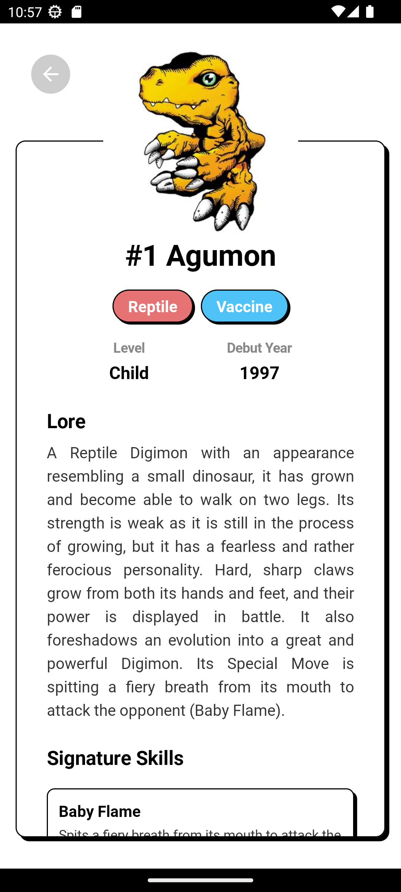
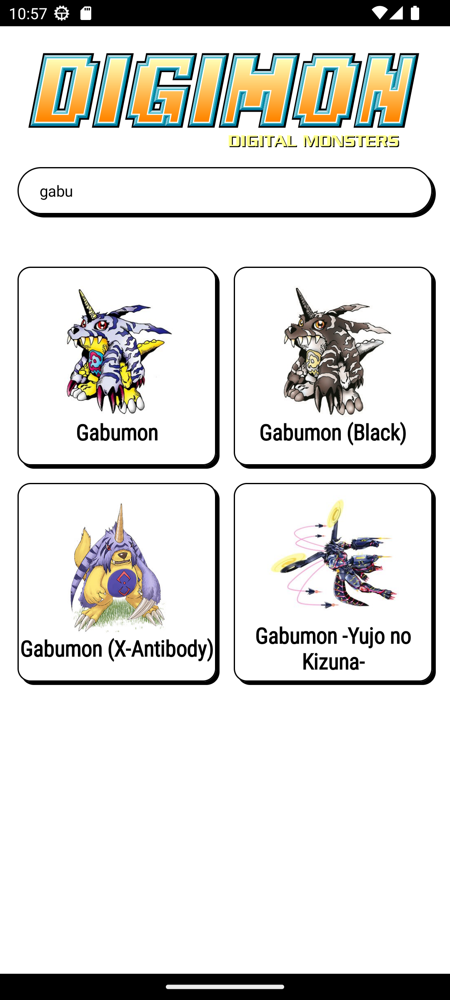

<h1 align="center">Digidex - Modern Android App for Digimon Dex</h1>

<p align="center">
  A beautiful, modern, and offline-first Android application built entirely with <b>Jetpack Compose</b> to browse and search the complete Digimon encyclopedia. This app consumes data from the <a href="https://digi-api.com/">Digi-API</a>.
</p>

## ✨ Features

- **Jetpack Compose UI**: 100% declarative UI built with Jetpack Compose.
- **Offline-First Support**: Browse previously loaded Digimon seamlessly without an internet connection using Room Database caching.
- **Debounced Search**: Highly optimized server-side search that reduces API load using Kotlin Coroutines `delay(300ms)` state flows.
- **Rich Encyclopedia**: 
  - Dynamic Type and Attribute badge colors.
  - Detailed Lore / Origin descriptions.
  - Interactive **Evolution Gallery** (Evolves From / To) that lets you navigate the entire evolution tree.
  - Signature Skills list.

## 🛠 Tech Stack

This project was built to demonstrate modern Android development best practices:

- **[Kotlin](https://kotlinlang.org/)**: 100% Kotlin codebase.
- **[Jetpack Compose](https://developer.android.com/jetpack/compose)**: Android’s modern toolkit for building native UI.
- **[Coroutines & Flow](https://kotlinlang.org/docs/coroutines-overview.html)**: For asynchronous programming and handling data streams.
- **[Dagger-Hilt](https://dagger.dev/hilt/)**: Standard Dependency Injection framework for Android.
- **[Retrofit 2](https://square.github.io/retrofit/)**: Type-safe HTTP client for network requests.
- **[Room Database](https://developer.android.com/training/data-storage/room)**: SQLite object mapping library for offline caching.
- **[Coil](https://coil-kt.github.io/coil/compose/)**: Image loading library specifically designed for Jetpack Compose.

## 🏗 Architecture

The application follows the **MVVM (Model-View-ViewModel)** architectural pattern and Clean Architecture principles:

- **UI Layer**: Jetpack Compose screens and ViewModels. State is hoisted and collected from ViewModels.
- **Data Layer**: 
  - **Remote**: Retrofit fetches data from the REST API.
  - **Local**: Room Database acts as the single source of truth for the offline-first experience.
- **Repository**: Coordinates data between the remote API and the local Room database, gracefully falling back to local data if the network is unavailable.

## 📸 Screenshots

<p align="center">
  
  
  
</p>

## 🚀 How to Run

1. Clone the repository:
   ```bash
   git clone https://github.com/qyupaww/digidex.git
   ```
2. Open the project in **Android Studio (Giraffe or newer)**.
3. Perform a Gradle Sync.
4. Hit **Run** on an Emulator or a physical Android device.

## 🤝 Acknowledgements

- Data provided by [Digi-API](https://digi-api.com/).

---
*Created as a personal portfolio project to demonstrate modern Android Development capabilities.*
